# Virtual Network Security Lab Setup

## Goal

After earning my CompTIA Network+ and Security+ certifications, I wanted to gain more hands-on experience with networking and cybersecurity technologies while continuing my education. Building this virtualized lab allows me to practice configuring network devices, implementing security controls, and using tools commonly found in cybersecurity environments.

**Virtual Cybersecurity Lab Using a Physical Cisco Switch and Virtual Machines Hosted on a Windows PC**

---

## Step 1: Configure the Virtual Environment

To begin, I built a small physical network using a Cisco Catalyst switch and a Windows desktop PC. The switch was connected to my home router for internet access, while my desktop was connected directly to the switch for management and testing purposes.

I used a console cable to perform the initial switch configuration, including setting the hostname and configuring administrative credentials.


After completing the initial setup, I enabled SSH to allow secure remote management of the switch without requiring a console connection.


To verify connectivity, I successfully pinged the switch from my PC and confirmed that the switch had learned my device's MAC address by reviewing the ARP table.


For now, the switch remains separate from the virtual lab environment. In the future, I plan to install an additional network interface card (NIC) in my PC so pfSense can interact directly with my physical network infrastructure.

I then installed pfSense in VirtualBox and configured it as the primary firewall and router for the lab environment. VirtualBox NAT was used to simulate WAN connectivity, while pfSense managed the internal networks.


To simulate an attacker system, I deployed a Kali Linux virtual machine through VirtualBox.


I also deployed a Windows virtual machine to act as the target system. DHCP services were configured through pfSense to automatically assign IP addresses, and connectivity between the systems was verified through successful ping tests.

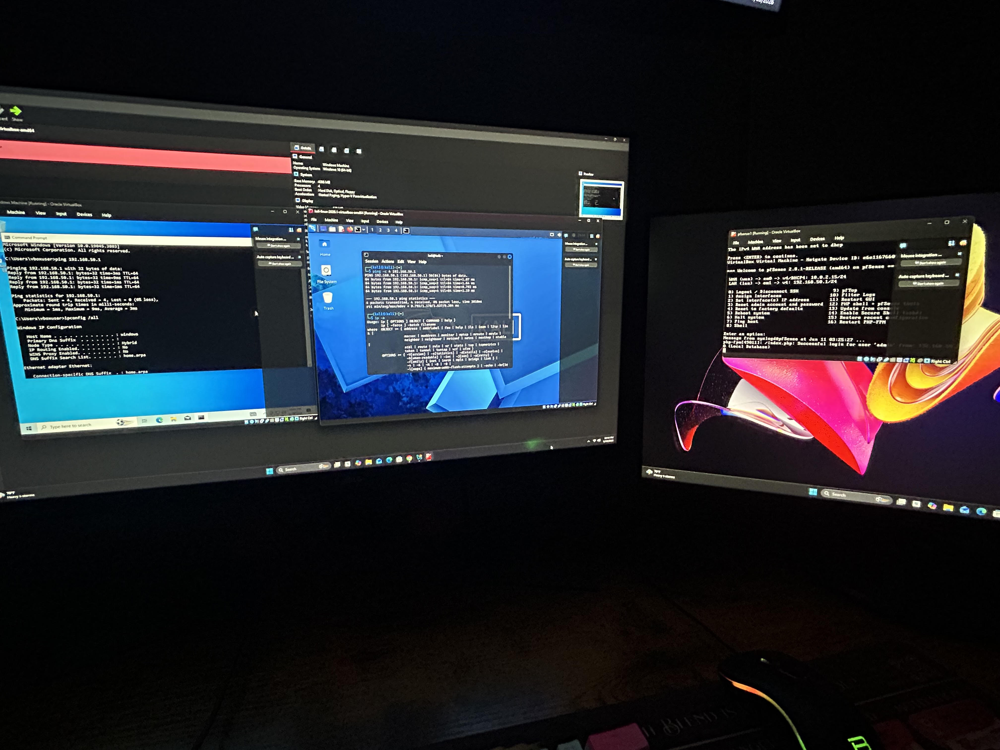

---

# Lab 1: Blocking Unauthorized Network Reconnaissance with pfSense

## Objective

Demonstrate how pfSense firewall rules can be used to prevent network reconnaissance activity originating from an attacker system.

---

## Phase 1: Reconnaissance

The first step was to perform reconnaissance against the Windows target machine using Nmap from the Kali Linux system. This scan was used to identify open ports and services available on the target host.

The scan successfully detected multiple Windows services exposed on the network.


---

## Phase 2: Firewall Mitigation

After identifying the exposed services, I created a pfSense firewall rule that blocked traffic originating from the Kali Linux subnet and destined for the Windows system.

This rule demonstrates how network segmentation and firewall policies can be used to restrict communication between different security zones.


---

## Phase 3: Verification

After applying the firewall rule, I repeated the Nmap scan against the Windows machine to verify that the security control was functioning as intended.

The scan was unable to successfully discover the target system, confirming that the firewall policy was preventing reconnaissance traffic from reaching the victim machine.


---

## What I Learned

Through this lab, I gained hands-on experience with:

- Configuring pfSense interfaces and firewall rules
- Building and managing a segmented virtual network
- Deploying Kali Linux and Windows virtual machines
- Using Nmap for reconnaissance and service discovery
- Understanding the difference between host-based and network-based firewalls
- Verifying firewall effectiveness through testing
- Implementing network segmentation as a security control

This lab demonstrated how properly configured firewall rules can disrupt the reconnaissance phase of an attack by preventing host discovery and service enumeration between network segments.

---

# Lab 2: Detecting Network Reconnaissance with Suricata IDS

## Objective

The goal of this lab was to deploy Suricata on pfSense and use it as an Intrusion Detection System (IDS) to monitor traffic between network segments. Unlike the previous lab, which focused on blocking traffic with firewall rules, this lab focused on detecting and analyzing suspicious activity generated by an attacker system.

---

## Step 1: Install Suricata

I installed the Suricata package through the pfSense Package Manager. Suricata provides intrusion detection and intrusion prevention capabilities by analyzing network traffic and comparing it against known threat signatures.

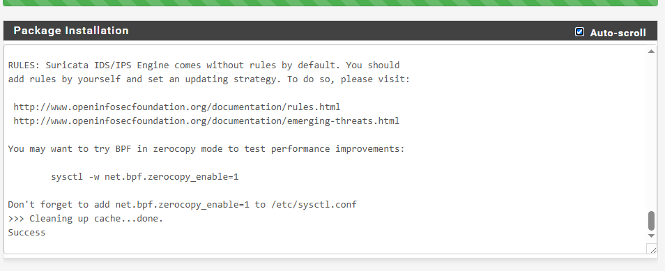

---

## Step 2: Configure Detection Rules

After installing Suricata, I enabled Emerging Threats Open rules and selected several categories designed to detect reconnaissance, denial-of-service activity, malware traffic, and other suspicious behavior.

The following rule categories were enabled:

- Emerging Scan Rules
- Emerging ICMP Rules
- Emerging DoS Rules
- Emerging Malware Rules
- Emerging Attack Response Rules

These signatures allow Suricata to inspect traffic and generate alerts when suspicious activity is detected.

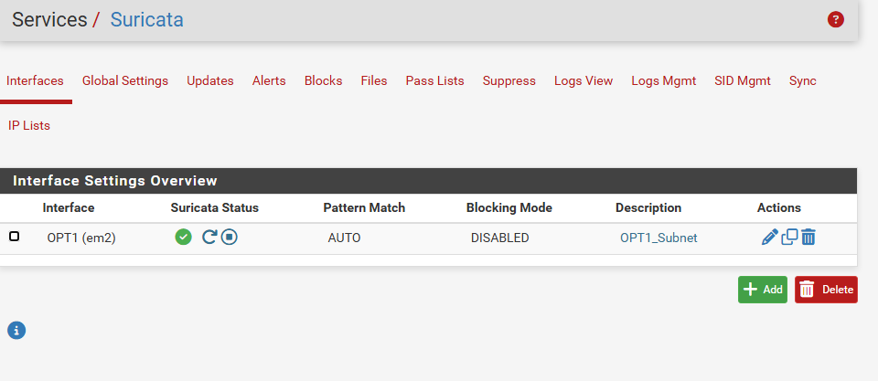

---

## Step 3: Simulate Attacker Activity

To generate traffic for the IDS to analyze, I used Kali Linux to perform reconnaissance against the Windows target machine.

Using Nmap, I conducted service discovery and host enumeration against the Windows system. This simulated the reconnaissance phase of an attack, where an attacker attempts to identify exposed services and gather information about a target.

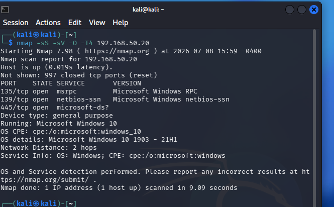

---

## Step 4: Analyze IDS Alerts

After performing the scan, Suricata generated multiple alerts indicating abnormal network activity between the Kali Linux machine and the Windows target.

The IDS detected protocol anomalies and suspicious SMB-related traffic originating from the attacker system. These alerts demonstrate Suricata's ability to identify unusual behavior and provide visibility into activity occurring across the network.

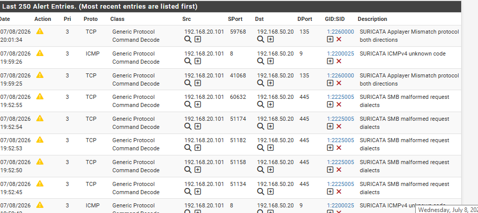

---

## Results

During this lab, Suricata successfully monitored traffic between network segments and generated alerts based on activity originating from the Kali Linux machine. Although the scan was not blocked, the IDS provided visibility into the reconnaissance activity and recorded multiple events for further investigation.

Source IP:
- 192.168.20.101 (Kali Linux)

Destination IP:
- 192.168.50.20 (Windows)

Example Alerts:
- SURICATA SMB malformed request dialects
- SURICATA AppLayer Mismatch protocol both directions
- SURICATA ICMPv4 unknown code

---

## What I Learned

Through this lab, I gained hands-on experience with:

- Installing and configuring Suricata on pfSense
- Managing IDS rule sets
- Understanding signature-based detection
- Monitoring network traffic between segmented networks
- Generating and analyzing IDS alerts
- Performing reconnaissance using Nmap
- Investigating suspicious SMB and protocol activity
- # Lab 3: Simulating and Preventing a Rogue DNS Attack

## Objective

The goal of this lab was to simulate a rogue DNS attack in an isolated virtual environment. A Kali Linux machine was configured to act as an unauthorized DNS server that redirected a test domain to a different web server.

After confirming that the redirection worked, I configured pfSense firewall rules to prevent Windows clients from communicating with unauthorized DNS servers.

This lab demonstrated:

- Legitimate DNS resolution
- DNS host overrides
- Rogue DNS redirection
- DNS cache behavior
- Unauthorized DNS prevention
- Firewall log analysis

---

## Lab Environment

The lab used the following systems:

- **pfSense:** Firewall, router, and legitimate DNS resolver
- **Kali Linux:** Rogue DNS server and Apache web server
- **Windows 10:** Client and legitimate IIS web server
- **VirtualBox:** Virtualization platform

### Network Information

```text
pfSense LAN:       192.168.50.1
Windows 10:        192.168.50.20
pfSense OPT1:      192.168.20.1
Kali Linux:        192.168.20.101
Test domain:       portal.test
```

---

## Phase 1: Configure the Legitimate Web Server

I first enabled Internet Information Services on the Windows virtual machine. IIS provided a basic webpage that represented the legitimate destination for the test domain.

I verified that the Windows web server was running by opening the loopback address in the Windows browser:

```text
http://127.0.0.1
```

The default IIS information page successfully loaded, confirming that the Windows machine was hosting a functional web service.

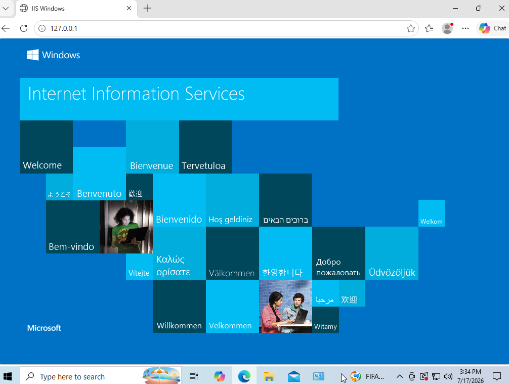

---

## Phase 2: Configure Legitimate DNS Resolution

I configured a host override in the pfSense DNS Resolver.

The override mapped the test domain to the Windows web server:

```text
portal.test → 192.168.50.20
```

This represented the correct and authorized DNS record.

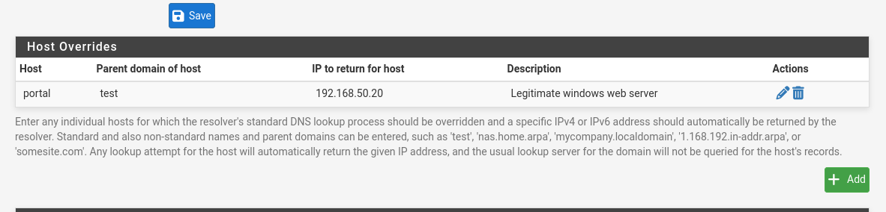

After applying the host override, entering the following address in the Windows browser loaded the legitimate IIS webpage:

```text
http://portal.test
```

This established the expected DNS behavior before introducing the rogue DNS server.

---

## Phase 3: Configure the Rogue Web Server

I configured Apache on the Kali Linux machine to represent the unauthorized destination.

The Kali web server was tested from the Windows machine by directly entering Kali's IP address:

```text
http://192.168.20.101
```

The Apache default webpage loaded successfully, confirming that Windows could reach the Kali web server across the segmented network.

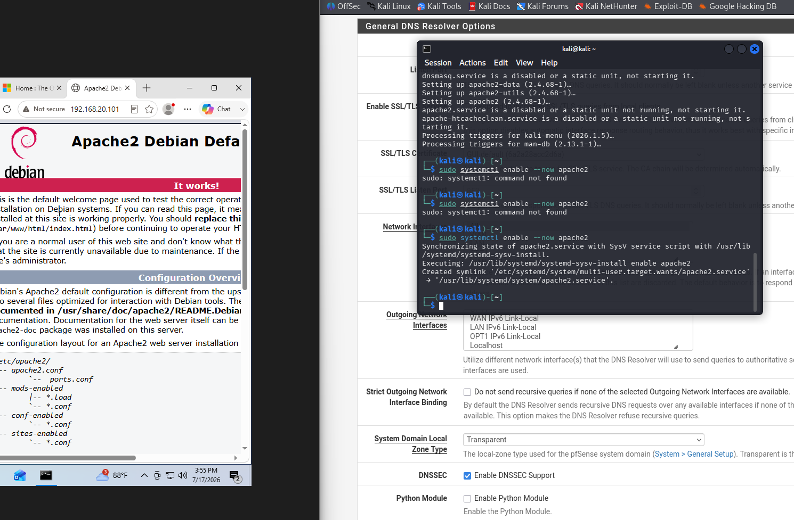

---

## Phase 4: Configure the Rogue DNS Server

I installed and configured `dnsmasq` on Kali Linux.

The rogue DNS configuration created an unauthorized record that mapped the same test domain to the Kali Linux address:

```text
portal.test → 192.168.20.101
```

This conflicted with the legitimate pfSense record, which pointed the domain to the Windows web server.

I tested the rogue DNS record from Kali using the following command:

```bash
dig @192.168.20.101 portal.test
```

The response showed that the rogue DNS server returned the Kali Linux IP address.

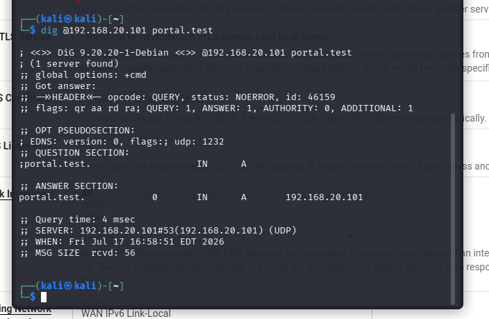

---

## Phase 5: Redirect the Windows Client

To simulate a compromised or misconfigured client, I temporarily changed the Windows DNS server from pfSense to the Kali Linux machine:

```text
Authorized DNS server:   192.168.50.1
Rogue DNS server:        192.168.20.101
```

I then cleared the Windows DNS cache:

```cmd
ipconfig /flushdns
```

After the cache was cleared, the domain resolved to the rogue address:

```text
portal.test → 192.168.20.101
```

When I entered `portal.test` in the Windows browser, the browser displayed Kali's Apache webpage instead of the legitimate Windows IIS page.

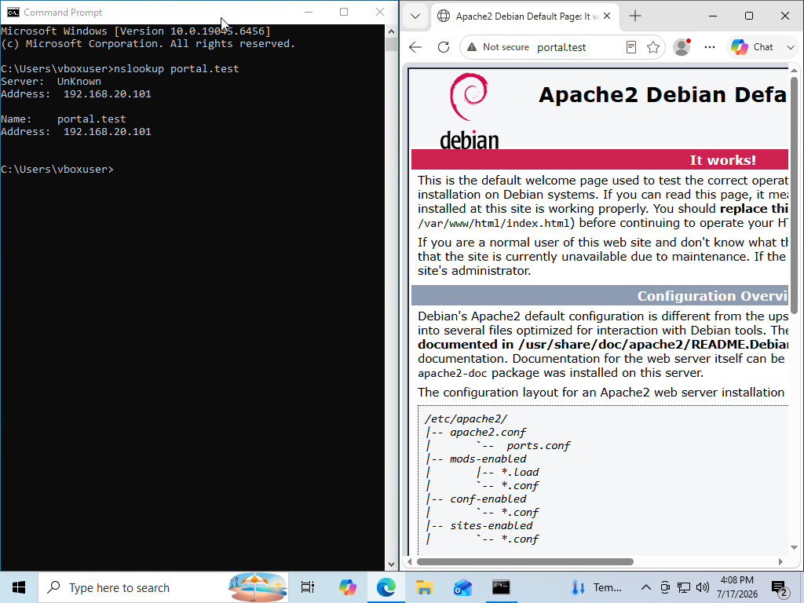

This confirmed that the rogue DNS server successfully altered the destination associated with the domain.

---

## Phase 6: Prevent Unauthorized DNS Communication

To prevent clients from using unauthorized DNS servers, I created firewall rules on the pfSense LAN interface.

The rules were designed to:

1. Allow LAN clients to send DNS requests to pfSense.
2. Reject DNS requests sent to any other destination.
3. Log rejected DNS traffic for investigation.

The intended rule order was:

```text
PASS    LAN net → pfSense LAN address    TCP/UDP port 53
REJECT  LAN net → Any                    TCP/UDP port 53
PASS    LAN net → Any                    Other permitted traffic
```

The allow rule had to remain above the reject rule because pfSense processes firewall rules from top to bottom.

---

## Phase 7: Verify the Mitigation

With Windows still configured to use Kali as its DNS server, I attempted another DNS lookup.

The request failed because pfSense rejected communication from the Windows client to the unauthorized DNS server on port 53.

The pfSense firewall logs showed rejected traffic with:

```text
Source:       192.168.50.20
Destination:  192.168.20.101
Port:         53
Protocol:     DNS over TCP or UDP
Action:       Reject
```

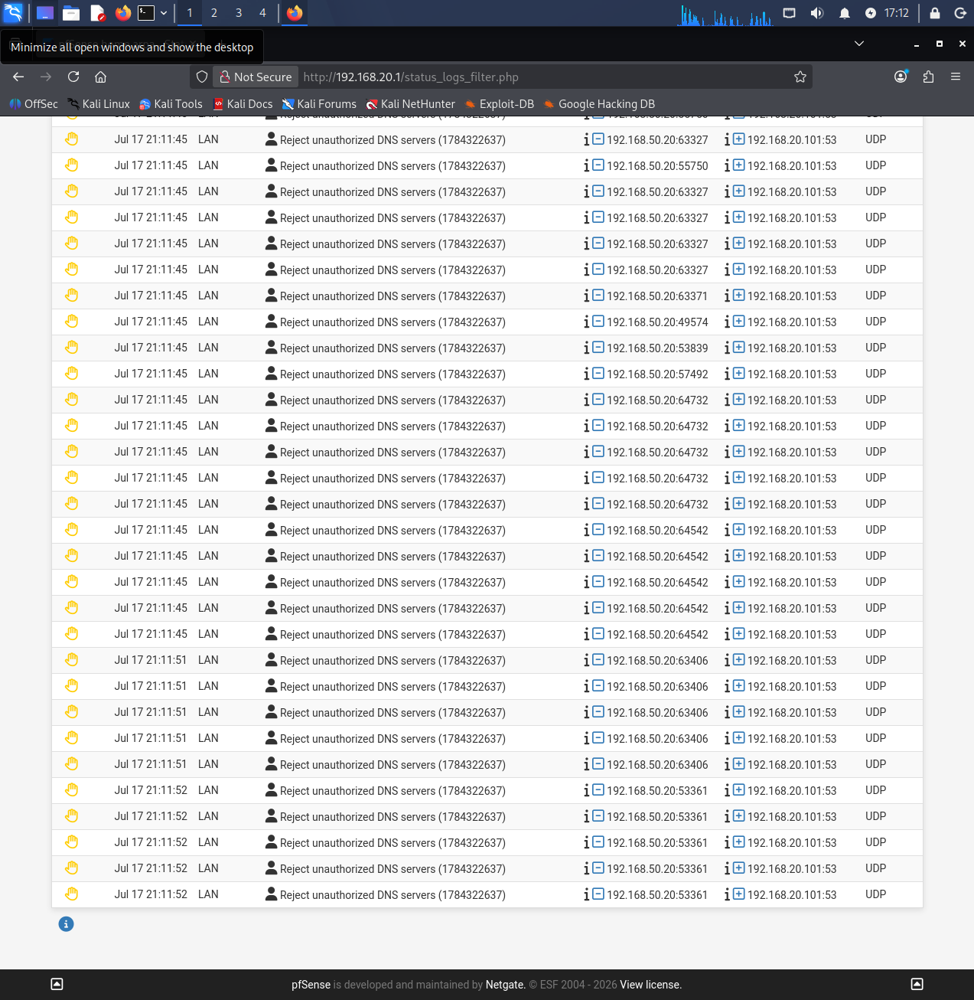

This confirmed that the firewall policy successfully prevented the Windows client from using the rogue DNS server.

---

## Restoring Legitimate DNS

After verifying the mitigation, I restored the Windows DNS setting to the authorized pfSense resolver:

```text
192.168.50.1
```

I then cleared the DNS cache again:

```cmd
ipconfig /flushdns
```

The legitimate DNS server once again returned:

```text
portal.test → 192.168.50.20
```

Opening `portal.test` returned the Windows IIS webpage instead of Kali's Apache page.

---

## Results

Before applying the defensive firewall rules:

```text
Windows client
      ↓
Kali rogue DNS server
      ↓
portal.test resolves to 192.168.20.101
      ↓
Kali Apache webpage loads
```

After applying the defensive firewall rules:

```text
Windows client
      ↓
Unauthorized DNS request to Kali
      ↓
Rejected by pfSense
```

Authorized DNS operation continued through pfSense:

```text
Windows client
      ↓
pfSense DNS Resolver
      ↓
portal.test resolves to 192.168.50.20
      ↓
Windows IIS webpage loads
```

---

## What I Learned

Through this lab, I gained hands-on experience with:

- Configuring IIS and Apache web servers
- Creating local DNS records using pfSense host overrides
- Configuring `dnsmasq` as a DNS server
- Testing DNS responses with `dig` and `nslookup`
- Understanding how clients trust configured DNS resolvers
- Simulating DNS redirection in an isolated network
- Clearing the Windows DNS cache
- Restricting DNS traffic with pfSense firewall rules
- Understanding the importance of firewall rule order
- Identifying rejected DNS traffic in firewall logs
- Comparing legitimate and unauthorized DNS resolution

This lab demonstrated that DNS security depends not only on the accuracy of DNS records, but also on controlling which DNS servers clients are permitted to use. By restricting DNS communication to an authorized resolver, pfSense prevented the Windows client from receiving altered records from the rogue Kali DNS server.

This lab demonstrated the difference between a firewall and an intrusion detection system. While a firewall controls traffic flow, an IDS provides visibility into network activity and helps identify potentially malicious behavior for further investigation.
