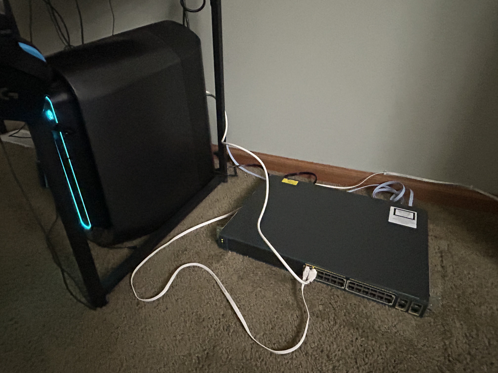
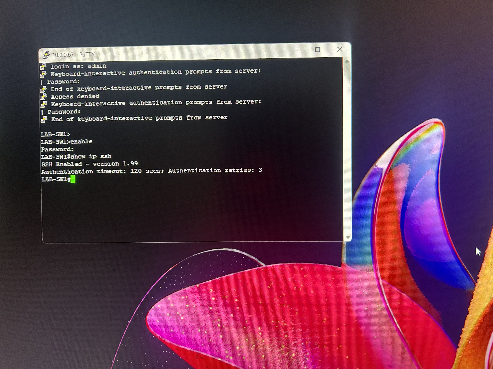
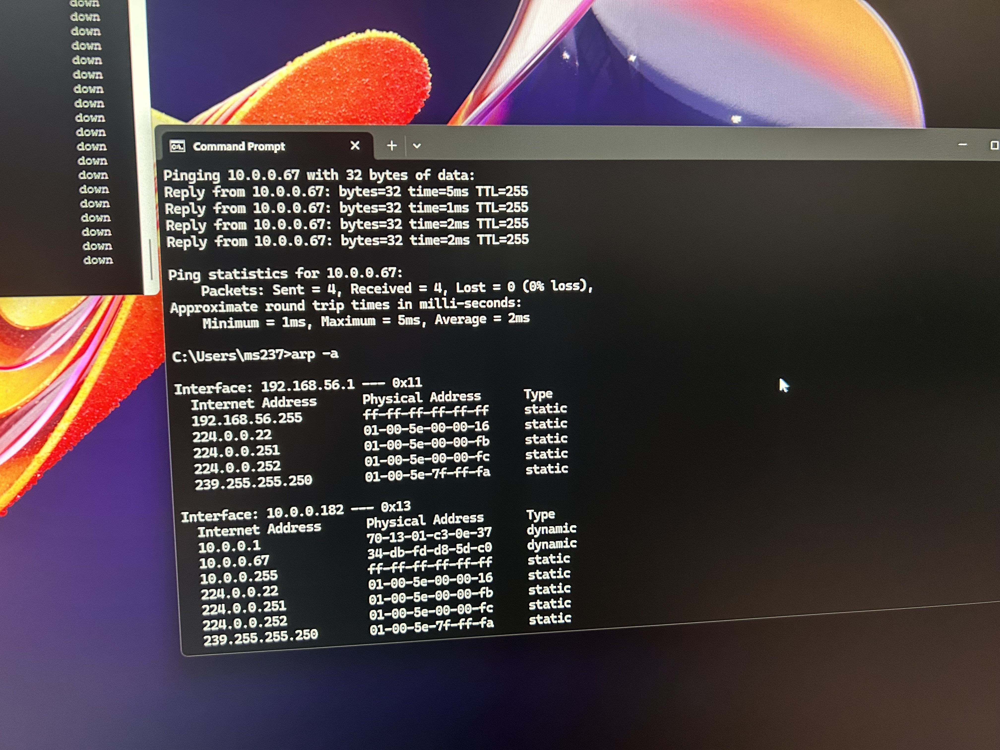
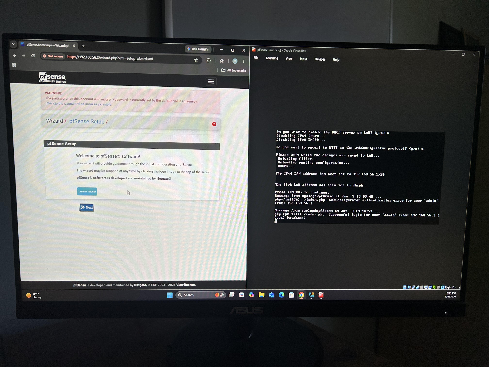

# virtual-network-security-lab-setup
Goal: After receiving my Network+ and Security+ certifications, I want to learn more hands on experience as im still in school. Configuring this virtualized network and running labs will allow me to gain more knowledge on certain commands and tools commonly used in Cybersecurity/network configuratin. 
Virtual Cybersecurity lab using a physical cisco switch + labs hosted on a windows pc
To begin, I set up a physical network using a Cisco Catalyst switch and a Windows Desktop PC. I connected the switch to my home router for internet access, then directly connected my desktop to the switch itself.:
I used a console cable to configure the name and of the switch and common security practices like a secret password, then I configured SSH so I can use an out of band managment way to configure the switch from now on.
Then, I confirmed connectivity by pinging the switch from my PC, and reading the arp table from my pc to ensure it has the switches MAC learned. 
For now I will keep the switch seperate until I add on another NIC to my pc to allow the pfSense router im going to configure in virtualbox act as if it was on my actual network. 
I downloaded and setup a virtual pfSense version and configured it, with virtualbox being simulated for the WAN, then pfSense as the firewall/router, then the LAN, which is  where I will place future VMs.  
Acting has the "threat actor machine" will be a kali linux machine I set up through VirtualBox. 

