# Virtual Network Security Lab Setup

## Goal

After earning my CompTIA Network+ and Security+ certifications, I wanted to gain more hands-on experience with networking and cybersecurity technologies while continuing my education. Building this virtualized lab allows me to practice configuring network devices, implementing security controls, and using tools commonly found in cybersecurity environments.

**Virtual Cybersecurity Lab Using a Physical Cisco Switch and Virtual Machines Hosted on a Windows PC**

---

## Step 1: Configure the Virtual Environment

To begin, I built a small physical network using a Cisco Catalyst switch and a Windows desktop PC. The switch was connected to my home router for internet access, while my desktop was connected directly to the switch for management and testing purposes.

I used a console cable to perform the initial switch configuration, including setting the hostname and configuring administrative credentials.

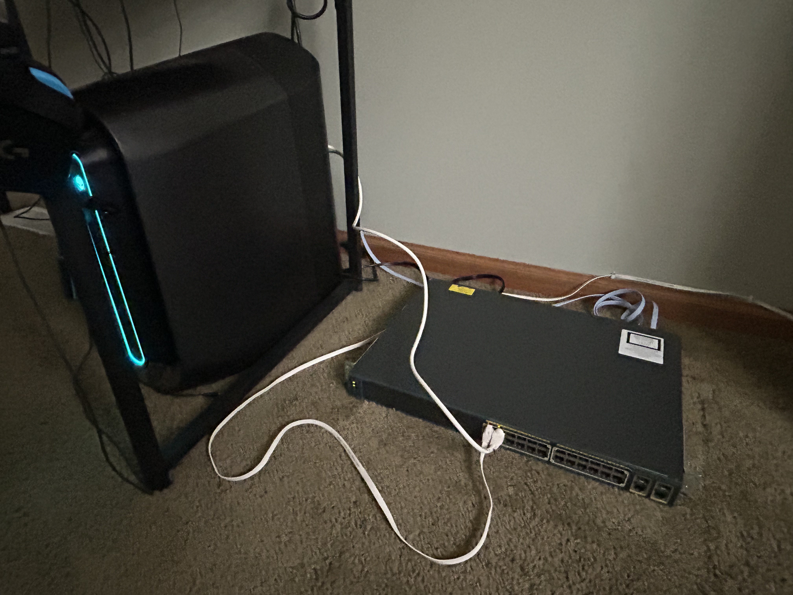

After completing the initial setup, I enabled SSH to allow secure remote management of the switch without requiring a console connection.

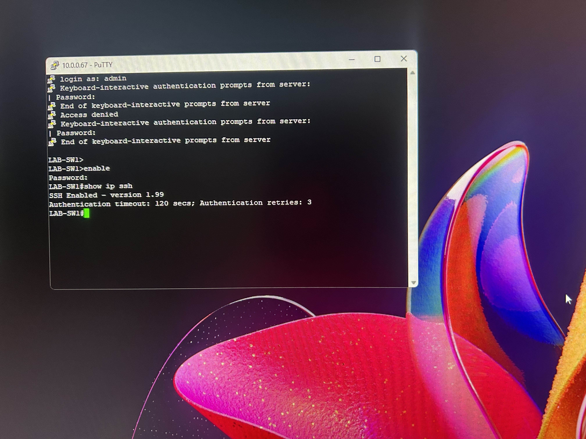

To verify connectivity, I successfully pinged the switch from my PC and confirmed that the switch had learned my device's MAC address by reviewing the ARP table.

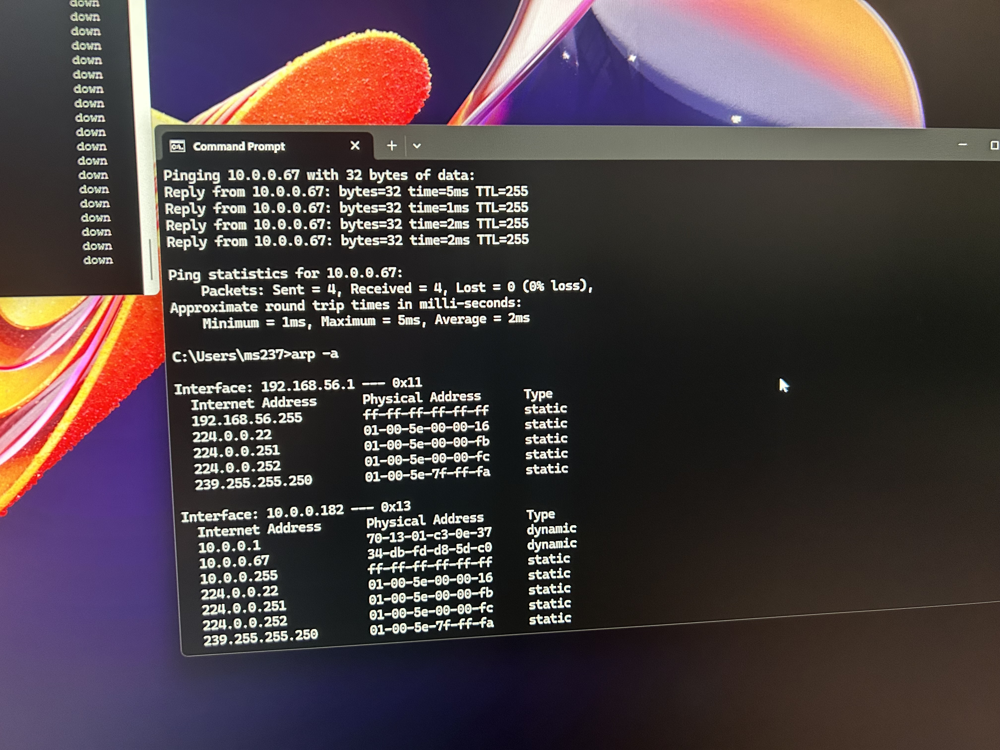

For now, the switch remains separate from the virtual lab environment. In the future, I plan to install an additional network interface card (NIC) in my PC so pfSense can interact directly with my physical network infrastructure.

I then installed pfSense in VirtualBox and configured it as the primary firewall and router for the lab environment. VirtualBox NAT was used to simulate WAN connectivity, while pfSense managed the internal networks.

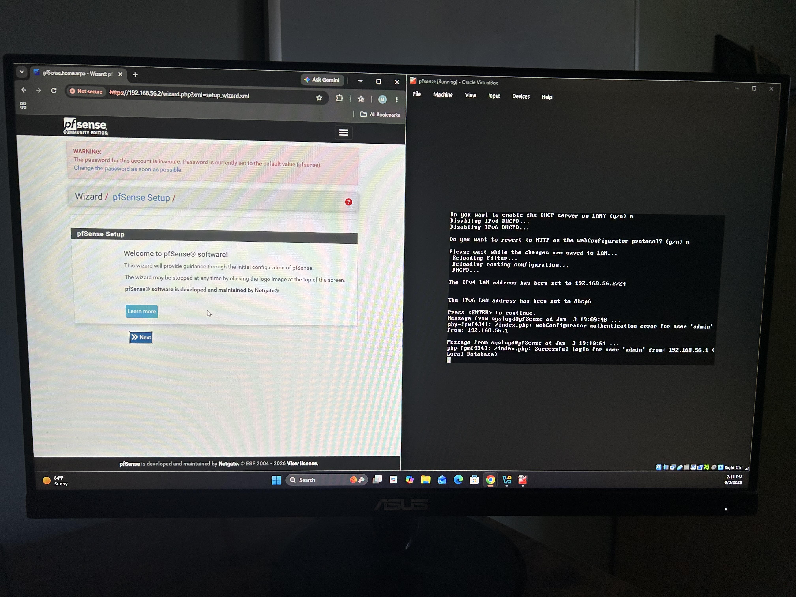

To simulate an attacker system, I deployed a Kali Linux virtual machine through VirtualBox.


I also deployed a Windows virtual machine to act as the target system. DHCP services were configured through pfSense to automatically assign IP addresses, and connectivity between the systems was verified through successful ping tests.

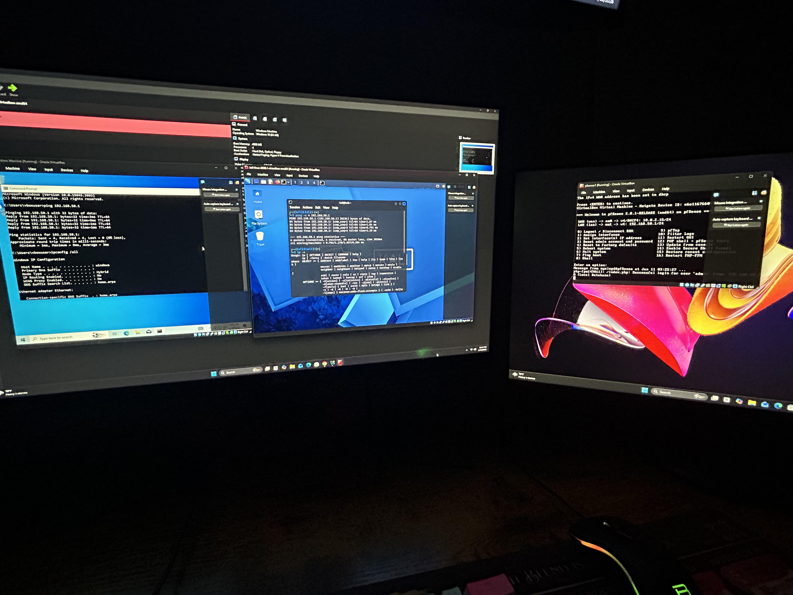

---

# Lab 1: Blocking Unauthorized Network Reconnaissance with pfSense

## Objective

Demonstrate how pfSense firewall rules can be used to prevent network reconnaissance activity originating from an attacker system.

---

## Phase 1: Reconnaissance

The first step was to perform reconnaissance against the Windows target machine using Nmap from the Kali Linux system. This scan was used to identify open ports and services available on the target host.

The scan successfully detected multiple Windows services exposed on the network.


---

## Phase 2: Firewall Mitigation

After identifying the exposed services, I created a pfSense firewall rule that blocked traffic originating from the Kali Linux subnet and destined for the Windows system.

This rule demonstrates how network segmentation and firewall policies can be used to restrict communication between different security zones.


---

## Phase 3: Verification

After applying the firewall rule, I repeated the Nmap scan against the Windows machine to verify that the security control was functioning as intended.

The scan was unable to successfully discover the target system, confirming that the firewall policy was preventing reconnaissance traffic from reaching the victim machine.


---

## What I Learned

Through this lab, I gained hands-on experience with:

- Configuring pfSense interfaces and firewall rules
- Building and managing a segmented virtual network
- Deploying Kali Linux and Windows virtual machines
- Using Nmap for reconnaissance and service discovery
- Understanding the difference between host-based and network-based firewalls
- Verifying firewall effectiveness through testing
- Implementing network segmentation as a security control

This lab demonstrated how properly configured firewall rules can disrupt the reconnaissance phase of an attack by preventing host discovery and service enumeration between network segments.

---

# Lab 2: Detecting Network Reconnaissance with Suricata IDS

## Objective

The goal of this lab was to deploy Suricata on pfSense and use it as an Intrusion Detection System (IDS) to monitor traffic between network segments. Unlike the previous lab, which focused on blocking traffic with firewall rules, this lab focused on detecting and analyzing suspicious activity generated by an attacker system.

---

## Step 1: Install Suricata

I installed the Suricata package through the pfSense Package Manager. Suricata provides intrusion detection and intrusion prevention capabilities by analyzing network traffic and comparing it against known threat signatures.

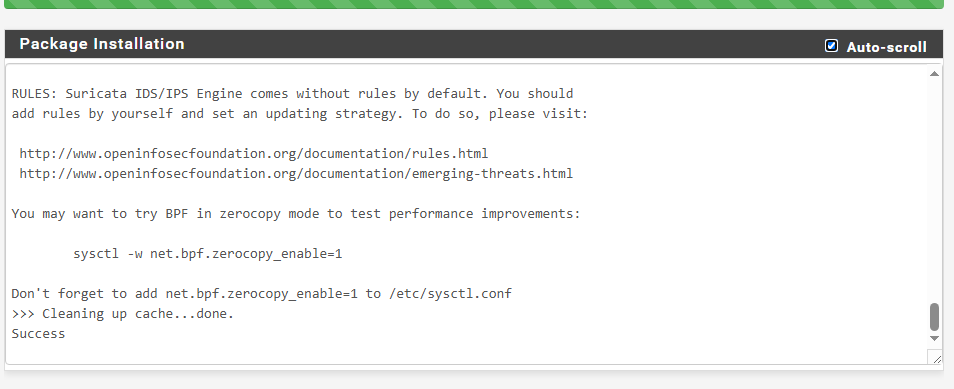

---

## Step 2: Configure Detection Rules

After installing Suricata, I enabled Emerging Threats Open rules and selected several categories designed to detect reconnaissance, denial-of-service activity, malware traffic, and other suspicious behavior.

The following rule categories were enabled:

- Emerging Scan Rules
- Emerging ICMP Rules
- Emerging DoS Rules
- Emerging Malware Rules
- Emerging Attack Response Rules

These signatures allow Suricata to inspect traffic and generate alerts when suspicious activity is detected.

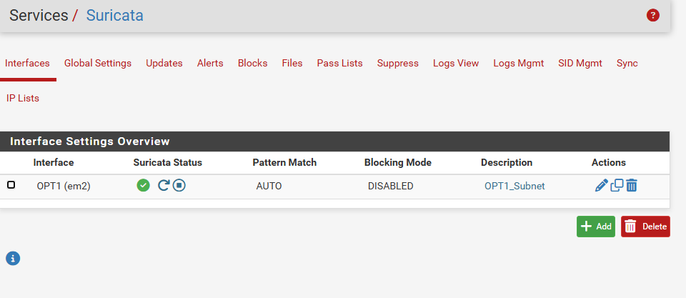

---

## Step 3: Simulate Attacker Activity

To generate traffic for the IDS to analyze, I used Kali Linux to perform reconnaissance against the Windows target machine.

Using Nmap, I conducted service discovery and host enumeration against the Windows system. This simulated the reconnaissance phase of an attack, where an attacker attempts to identify exposed services and gather information about a target.

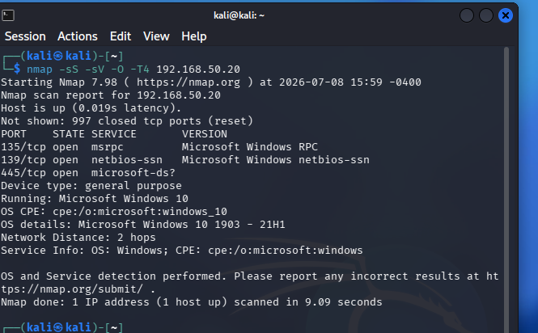

---

## Step 4: Analyze IDS Alerts

After performing the scan, Suricata generated multiple alerts indicating abnormal network activity between the Kali Linux machine and the Windows target.

The IDS detected protocol anomalies and suspicious SMB-related traffic originating from the attacker system. These alerts demonstrate Suricata's ability to identify unusual behavior and provide visibility into activity occurring across the network.

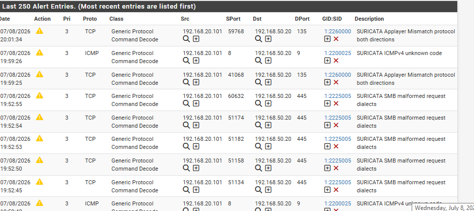

---

## Results

During this lab, Suricata successfully monitored traffic between network segments and generated alerts based on activity originating from the Kali Linux machine. Although the scan was not blocked, the IDS provided visibility into the reconnaissance activity and recorded multiple events for further investigation.

Source IP:
- 192.168.20.101 (Kali Linux)

Destination IP:
- 192.168.50.20 (Windows)

Example Alerts:
- SURICATA SMB malformed request dialects
- SURICATA AppLayer Mismatch protocol both directions
- SURICATA ICMPv4 unknown code

---

## What I Learned

Through this lab, I gained hands-on experience with:

- Installing and configuring Suricata on pfSense
- Managing IDS rule sets
- Understanding signature-based detection
- Monitoring network traffic between segmented networks
- Generating and analyzing IDS alerts
- Performing reconnaissance using Nmap
- Investigating suspicious SMB and protocol activity
- # Lab 3: Simulating and Preventing a Rogue DNS Attack

## Objective

The goal of this lab was to simulate a rogue DNS attack in an isolated virtual environment. A Kali Linux machine was configured to act as an unauthorized DNS server that redirected a test domain to a different web server.

After confirming that the redirection worked, I configured pfSense firewall rules to prevent Windows clients from communicating with unauthorized DNS servers.

This lab demonstrated:

- Legitimate DNS resolution
- DNS host overrides
- Rogue DNS redirection
- DNS cache behavior
- Unauthorized DNS prevention
- Firewall log analysis

---

## Lab Environment

The lab used the following systems:

- **pfSense:** Firewall, router, and legitimate DNS resolver
- **Kali Linux:** Rogue DNS server and Apache web server
- **Windows 10:** Client and legitimate IIS web server
- **VirtualBox:** Virtualization platform

### Network Information

```text
pfSense LAN:       192.168.50.1
Windows 10:        192.168.50.20
pfSense OPT1:      192.168.20.1
Kali Linux:        192.168.20.101
Test domain:       portal.test
```

---

## Phase 1: Configure the Legitimate Web Server

I first enabled Internet Information Services on the Windows virtual machine. IIS provided a basic webpage that represented the legitimate destination for the test domain.

I verified that the Windows web server was running by opening the loopback address in the Windows browser:

```text
http://127.0.0.1
```

The default IIS information page successfully loaded, confirming that the Windows machine was hosting a functional web service.

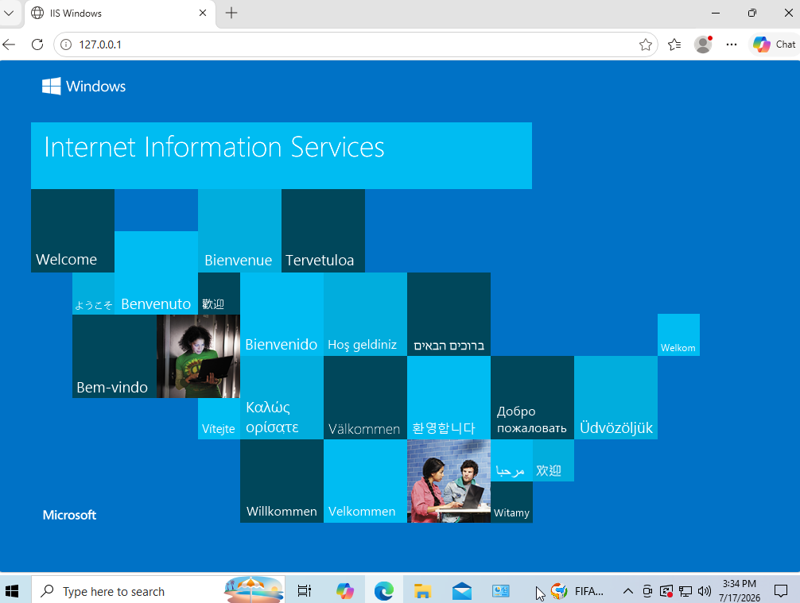

---

## Phase 2: Configure Legitimate DNS Resolution

I configured a host override in the pfSense DNS Resolver.

The override mapped the test domain to the Windows web server:

```text
portal.test → 192.168.50.20
```

This represented the correct and authorized DNS record.

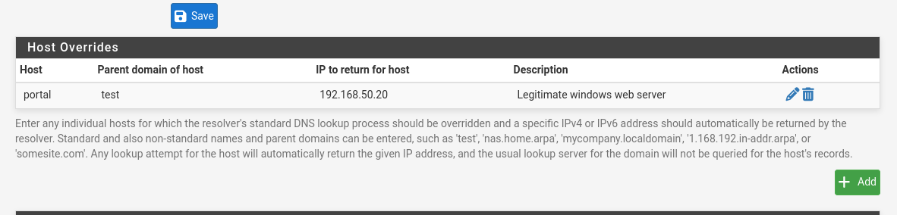

After applying the host override, entering the following address in the Windows browser loaded the legitimate IIS webpage:

```text
http://portal.test
```

This established the expected DNS behavior before introducing the rogue DNS server.

---

## Phase 3: Configure the Rogue Web Server

I configured Apache on the Kali Linux machine to represent the unauthorized destination.

The Kali web server was tested from the Windows machine by directly entering Kali's IP address:

```text
http://192.168.20.101
```

The Apache default webpage loaded successfully, confirming that Windows could reach the Kali web server across the segmented network.

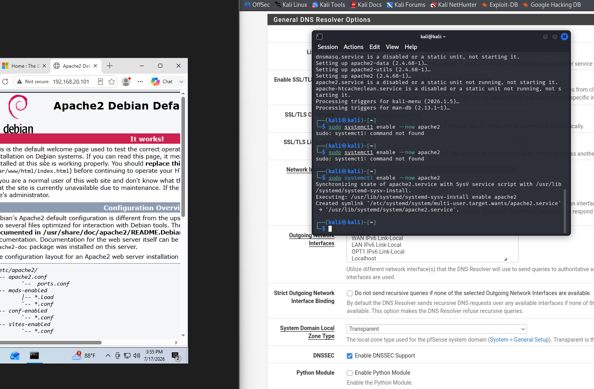

---

## Phase 4: Configure the Rogue DNS Server

I installed and configured `dnsmasq` on Kali Linux.

The rogue DNS configuration created an unauthorized record that mapped the same test domain to the Kali Linux address:

```text
portal.test → 192.168.20.101
```

This conflicted with the legitimate pfSense record, which pointed the domain to the Windows web server.

I tested the rogue DNS record from Kali using the following command:

```bash
dig @192.168.20.101 portal.test
```

The response showed that the rogue DNS server returned the Kali Linux IP address.

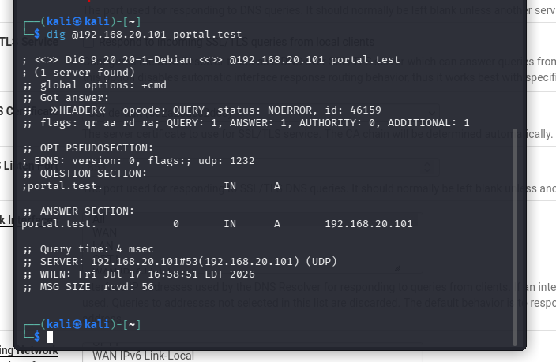

---

## Phase 5: Redirect the Windows Client

To simulate a compromised or misconfigured client, I temporarily changed the Windows DNS server from pfSense to the Kali Linux machine:

```text
Authorized DNS server:   192.168.50.1
Rogue DNS server:        192.168.20.101
```

I then cleared the Windows DNS cache:

```cmd
ipconfig /flushdns
```

After the cache was cleared, the domain resolved to the rogue address:

```text
portal.test → 192.168.20.101
```

When I entered `portal.test` in the Windows browser, the browser displayed Kali's Apache webpage instead of the legitimate Windows IIS page.

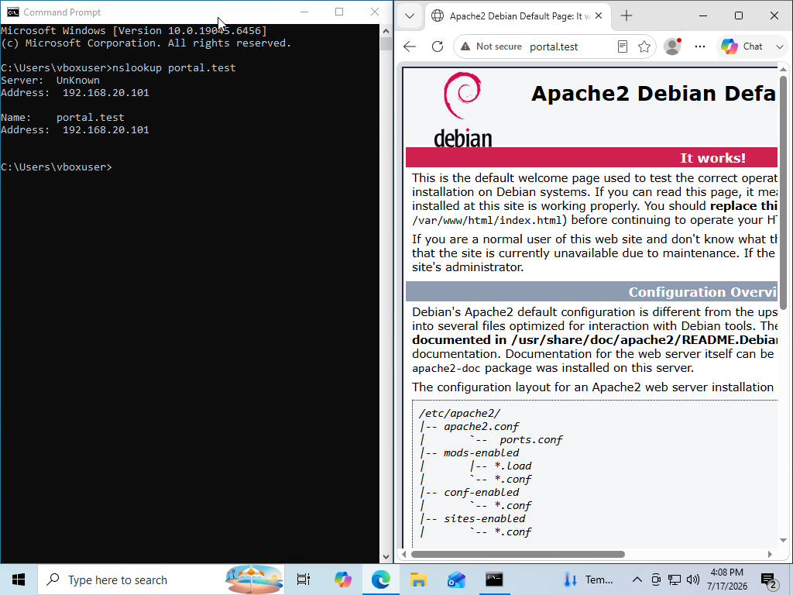

This confirmed that the rogue DNS server successfully altered the destination associated with the domain.

---

## Phase 6: Prevent Unauthorized DNS Communication

To prevent clients from using unauthorized DNS servers, I created firewall rules on the pfSense LAN interface.

The rules were designed to:

1. Allow LAN clients to send DNS requests to pfSense.
2. Reject DNS requests sent to any other destination.
3. Log rejected DNS traffic for investigation.

The intended rule order was:

```text
PASS    LAN net → pfSense LAN address    TCP/UDP port 53
REJECT  LAN net → Any                    TCP/UDP port 53
PASS    LAN net → Any                    Other permitted traffic
```

The allow rule had to remain above the reject rule because pfSense processes firewall rules from top to bottom.

---

## Phase 7: Verify the Mitigation

With Windows still configured to use Kali as its DNS server, I attempted another DNS lookup.

The request failed because pfSense rejected communication from the Windows client to the unauthorized DNS server on port 53.

The pfSense firewall logs showed rejected traffic with:

```text
Source:       192.168.50.20
Destination:  192.168.20.101
Port:         53
Protocol:     DNS over TCP or UDP
Action:       Reject
```

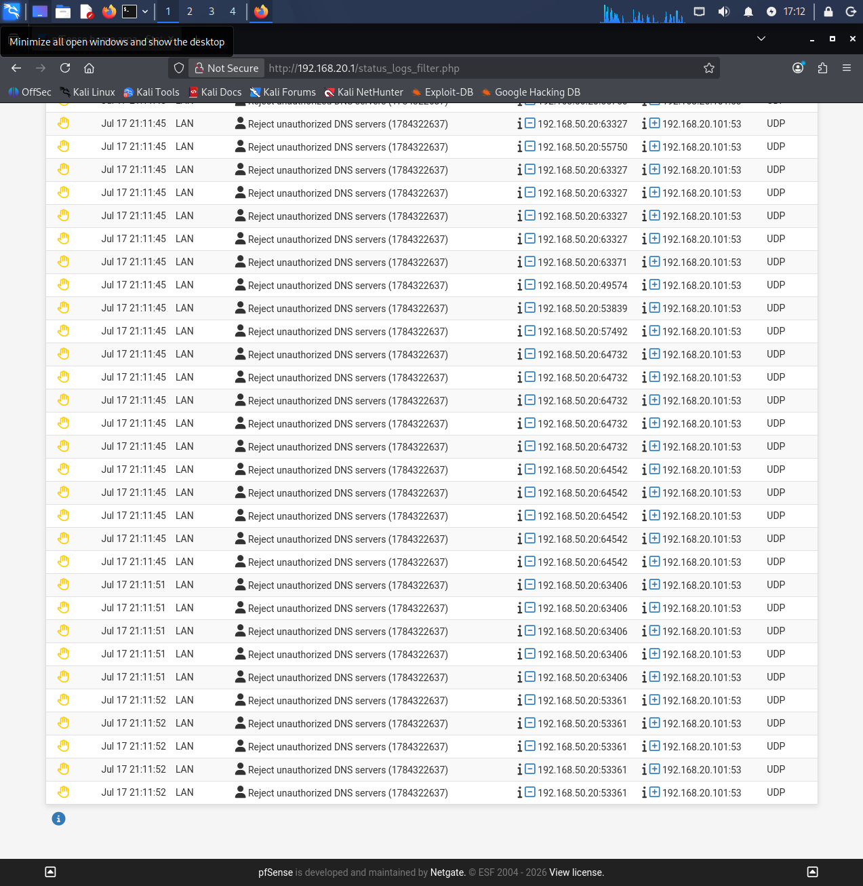

This confirmed that the firewall policy successfully prevented the Windows client from using the rogue DNS server.

---

## Restoring Legitimate DNS

After verifying the mitigation, I restored the Windows DNS setting to the authorized pfSense resolver:

```text
192.168.50.1
```

I then cleared the DNS cache again:

```cmd
ipconfig /flushdns
```

The legitimate DNS server once again returned:

```text
portal.test → 192.168.50.20
```

Opening `portal.test` returned the Windows IIS webpage instead of Kali's Apache page.

---

## Results

Before applying the defensive firewall rules:

```text
Windows client
      ↓
Kali rogue DNS server
      ↓
portal.test resolves to 192.168.20.101
      ↓
Kali Apache webpage loads
```

After applying the defensive firewall rules:

```text
Windows client
      ↓
Unauthorized DNS request to Kali
      ↓
Rejected by pfSense
```

Authorized DNS operation continued through pfSense:

```text
Windows client
      ↓
pfSense DNS Resolver
      ↓
portal.test resolves to 192.168.50.20
      ↓
Windows IIS webpage loads
```

---

## What I Learned

Through this lab, I gained hands-on experience with:

- Configuring IIS and Apache web servers
- Creating local DNS records using pfSense host overrides
- Configuring `dnsmasq` as a DNS server
- Testing DNS responses with `dig` and `nslookup`
- Understanding how clients trust configured DNS resolvers
- Simulating DNS redirection in an isolated network
- Clearing the Windows DNS cache
- Restricting DNS traffic with pfSense firewall rules
- Understanding the importance of firewall rule order
- Identifying rejected DNS traffic in firewall logs
- Comparing legitimate and unauthorized DNS resolution

This lab demonstrated that DNS security depends not only on the accuracy of DNS records, but also on controlling which DNS servers clients are permitted to use. By restricting DNS communication to an authorized resolver, pfSense prevented the Windows client from receiving altered records from the rogue Kali DNS server.

# Lab 4: Securing Physical Switch Access with pfSense

## Objective

The goal of this lab was to connect a physical Cisco switch to my virtual cybersecurity environment and use pfSense to control which systems could access it.

The trusted Windows virtual machine was allowed to manage the switch, while the Kali Linux machine was blocked.

---

## Switch and VLAN Configuration

I configured VLAN 10 for the home management network and VLAN 20 for the physical lab network.

The switch received the management address `192.168.60.2`, and its default gateway was changed to the pfSense physical interface at `192.168.60.1`.

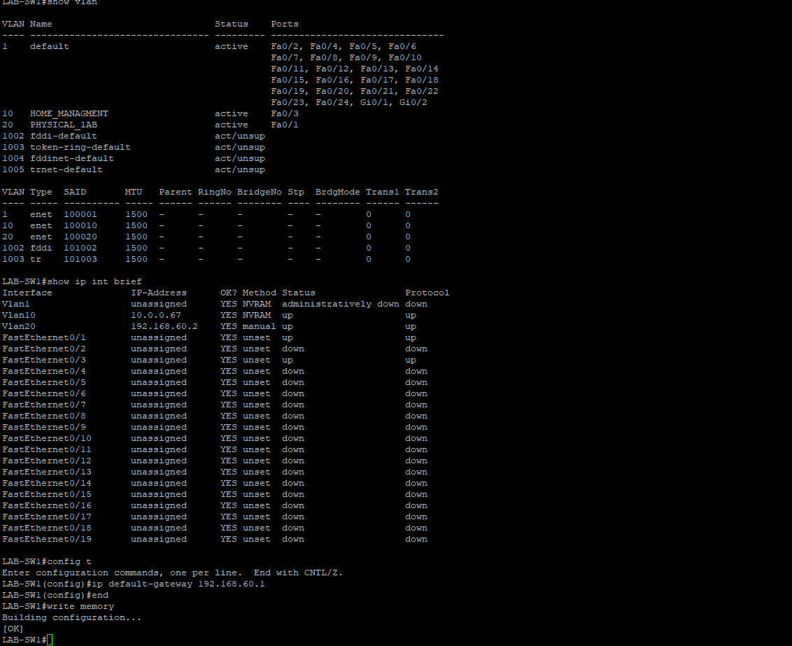

---

## LAN Firewall Rules

I created rules on the pfSense LAN interface that allowed the trusted Windows virtual machine to ping and access the switch through SSH.

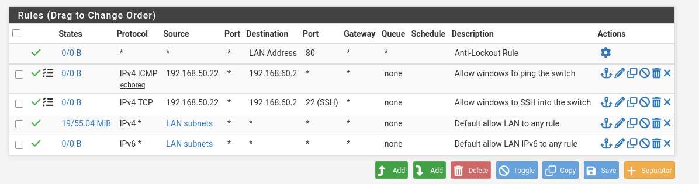

---

## Authorized Windows Access

After applying the LAN rules, the Windows virtual machine successfully connected to the physical Cisco switch through SSH.

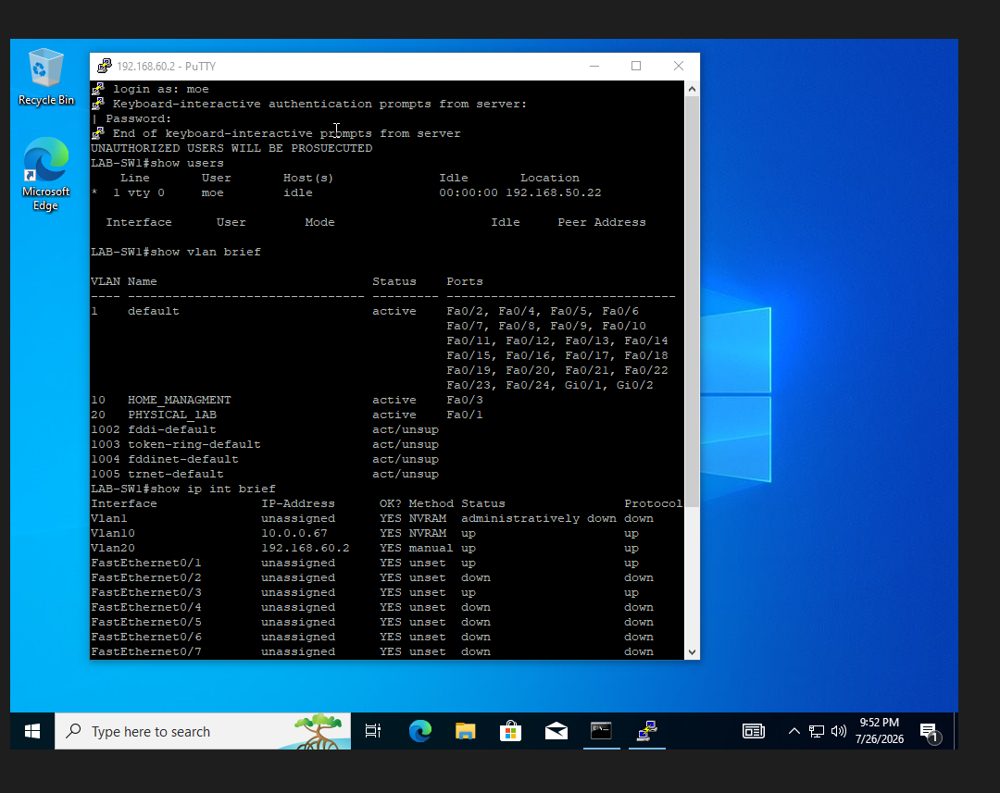

---

## OPT1 Firewall Rules

I created a block rule on the pfSense OPT1 interface to prevent the Kali Linux network from accessing the switch.

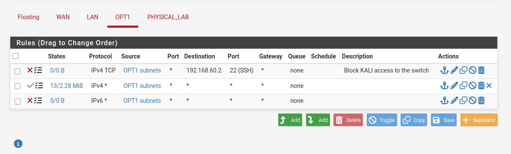

---

## Unauthorized Kali Access

Kali was unable to ping the switch, and the SSH port appeared as filtered during the scan.

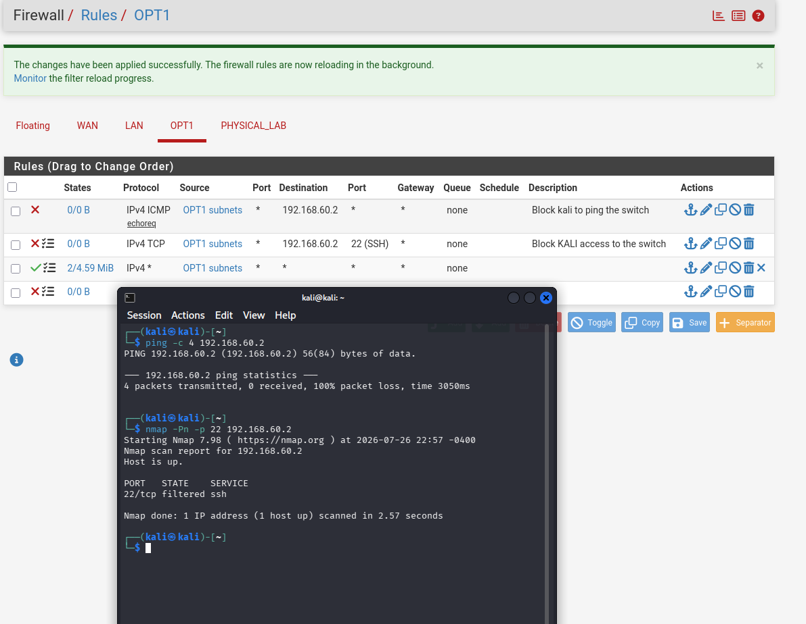

---

## Firewall Log Analysis

The pfSense logs confirmed that traffic from Kali to the switch was blocked, including ping and SSH connection attempts.

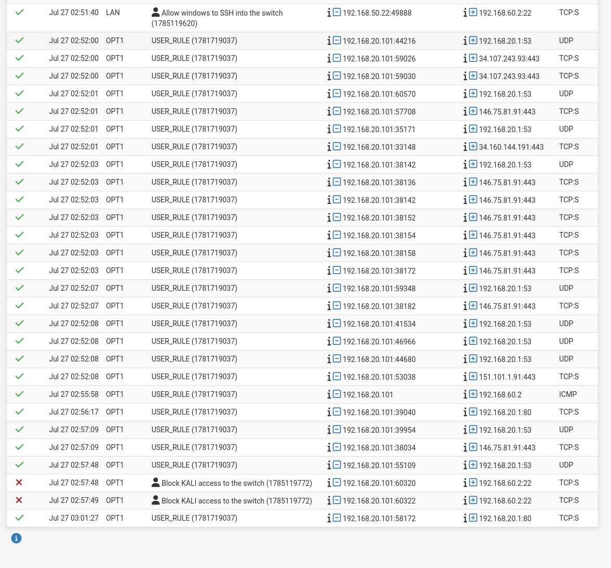

---

## Results

The final security policy produced the following results:

- Windows VM access to the switch was allowed.
- Kali Linux access to the switch was blocked.
- pfSense logged the unauthorized connection attempts.

---

## What I Learned

This lab gave me hands-on experience with:

- Cisco VLAN configuration
- Physical and virtual network integration
- Switch management interfaces
- pfSense firewall rules
- Secure SSH access
- Network segmentation
- Firewall log analysis

# Lab 5: Configuring an 802.1Q Trunk with pfSense and a Cisco Switch

## Objective

The goal of this lab was to configure an 802.1Q trunk between pfSense and a physical Cisco switch. This allowed VLAN 20 and VLAN 30 to share one physical network interface and Ethernet cable while remaining logically separated.

VLAN 20 was configured as the native VLAN, while VLAN 30 was used as the dedicated switch-management network.

---

## pfSense VLAN Configuration

I created VLAN 30 on the physical pfSense interface connected to the Cisco switch.

VLAN 30 used the following network:

```text
pfSense VLAN 30: 192.168.70.1
Cisco switch:    192.168.70.2
```

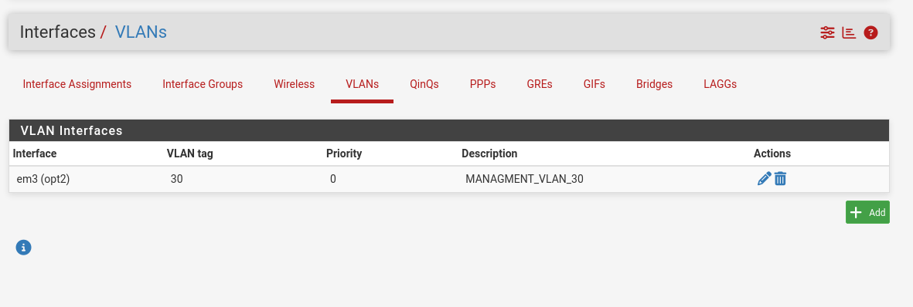

I then assigned VLAN 30 as a separate pfSense interface. The interface assignments show the virtual LAN, Kali network, physical network, and VLAN 30 management interface.

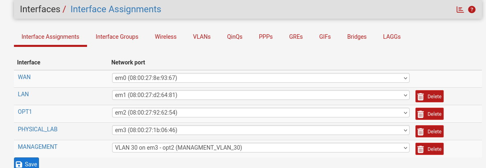

---

## Cisco Trunk Configuration

I converted the switch port connected to pfSense into an 802.1Q trunk.

The trunk was configured to carry VLANs 20 and 30, with VLAN 20 acting as the native VLAN.

```text
VLAN 20: Native and untagged
VLAN 30: Tagged management traffic
```

The trunk status was verified from the Cisco switch.

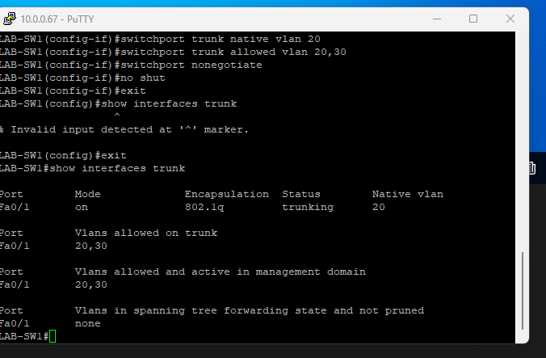

---

## Firewall Rules

Rules were created on the pfSense LAN interface to allow the trusted Windows virtual machine to ping and access the switch through SSH.


Rules were also created on OPT1 to prevent the Kali Linux network from accessing the VLAN 30 management network.

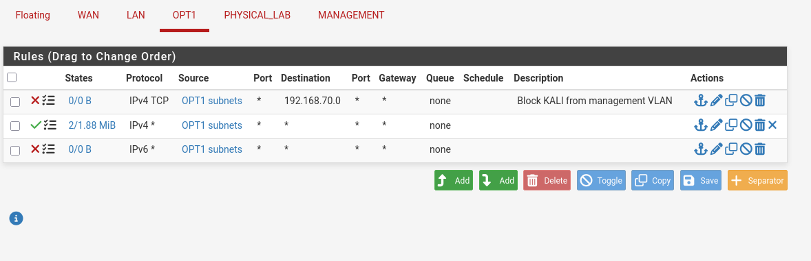

---

## Authorized Windows Access

The Windows virtual machine successfully connected to the Cisco switch using its VLAN 30 management address at `192.168.70.2`.

From the Windows SSH session, I verified the VLAN configuration on the physical switch.

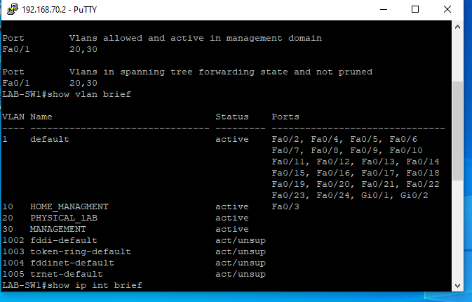

---

## Blocked Kali Access

Kali Linux attempted to scan TCP port 22 on the switch management address.

Nmap reported the SSH port as filtered, confirming that pfSense blocked Kali from reaching VLAN 30.

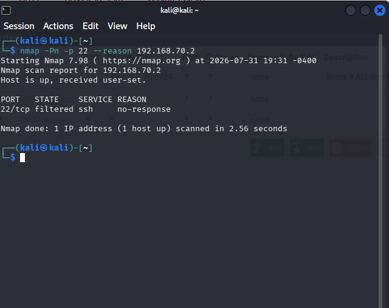

---

## Verify 802.1Q Tagging

I captured traffic on the physical trunk interface and opened the capture in Wireshark.

The capture showed 802.1Q-tagged traffic using VLAN ID 30, confirming that VLAN 30 traffic was being carried over the trunk.

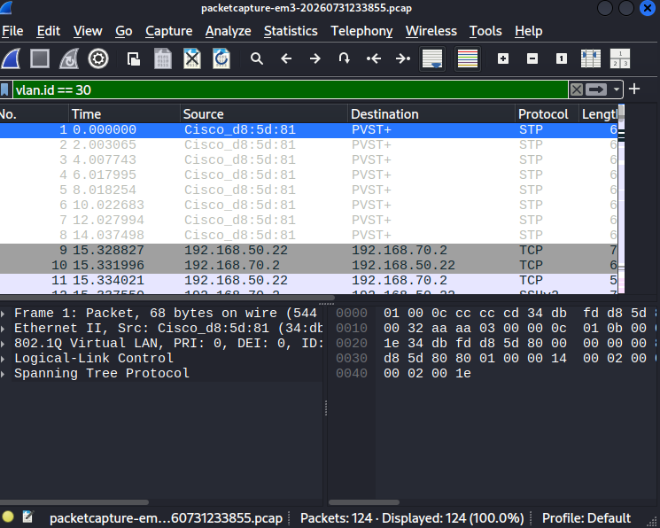

---

## Results

The completed configuration allowed:

- VLAN 20 and VLAN 30 to share one physical interface.
- Windows to access the switch management interface.
- pfSense to route and filter traffic to VLAN 30.
- Kali Linux to be blocked from the management VLAN.
- Wireshark to verify the presence of 802.1Q VLAN tags.

---

## What I Learned

Through this lab, I gained hands-on experience with:

- Creating VLAN interfaces in pfSense
- Configuring an 802.1Q trunk
- Assigning a native VLAN
- Carrying multiple VLANs over one physical interface
- Creating a dedicated management VLAN
- Applying firewall rules between networks
- Verifying VLAN tags with Wireshark
- Integrating virtual machines with a physical Cisco switch

This lab demonstrated the difference between a firewall and an intrusion detection system. While a firewall controls traffic flow, an IDS provides visibility into network activity and helps identify potentially malicious behavior for further investigation.

# Lab 6: Comparing SSH and Telnet Traffic

## Objective

The goal of this lab was to compare encrypted SSH traffic with plaintext Telnet traffic.

A Windows machine connected to a Kali Linux machine located on a different pfSense network interface. tcpdump was used on pfSense to capture the traffic, and Wireshark was used to analyze the saved PCAP files.

```text
Windows VM: 192.168.50.20
        ↓
      pfSense
        ↓
Kali Linux: 192.168.20.101
```

---

## Linux Services

I enabled SSH and Telnet on Kali Linux and confirmed that both services were listening.

```text
SSH:    TCP port 22
Telnet: TCP port 23
```


---

## pfSense Firewall Rules

I created pfSense firewall rules allowing the Windows machine to connect to Kali using SSH and Telnet.

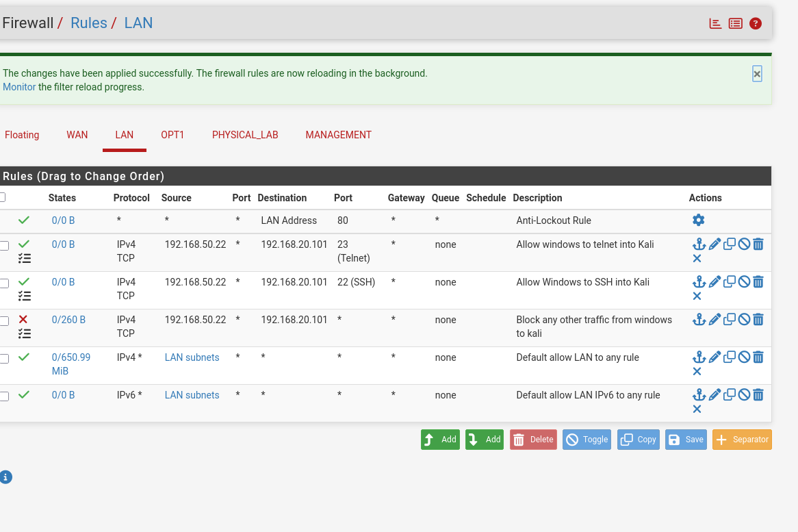

---

## SSH Capture

I started tcpdump on the pfSense LAN interface and saved the SSH traffic as a PCAP file.

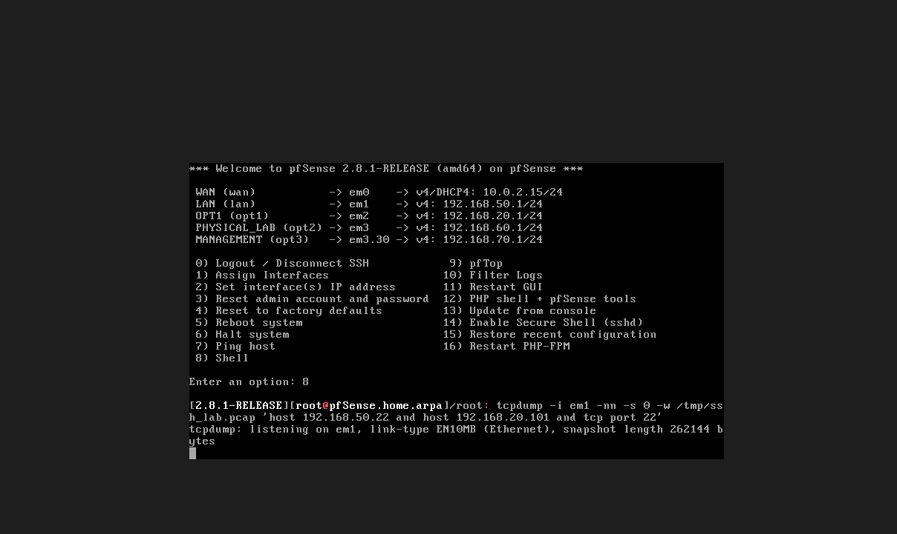

The Windows machine successfully connected to Kali through SSH and ran several remote commands.

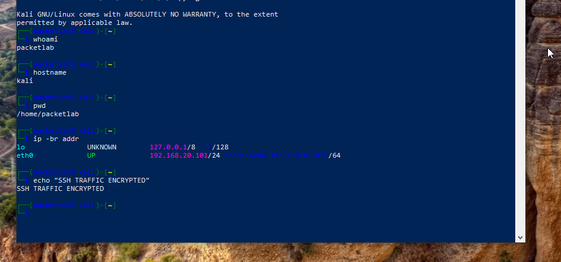

I opened the SSH capture in Wireshark and filtered for TCP port 22.

Although the connection, protocol information, and encrypted packets were visible, the username, password, commands, and command output could not be read because SSH encrypts the session.

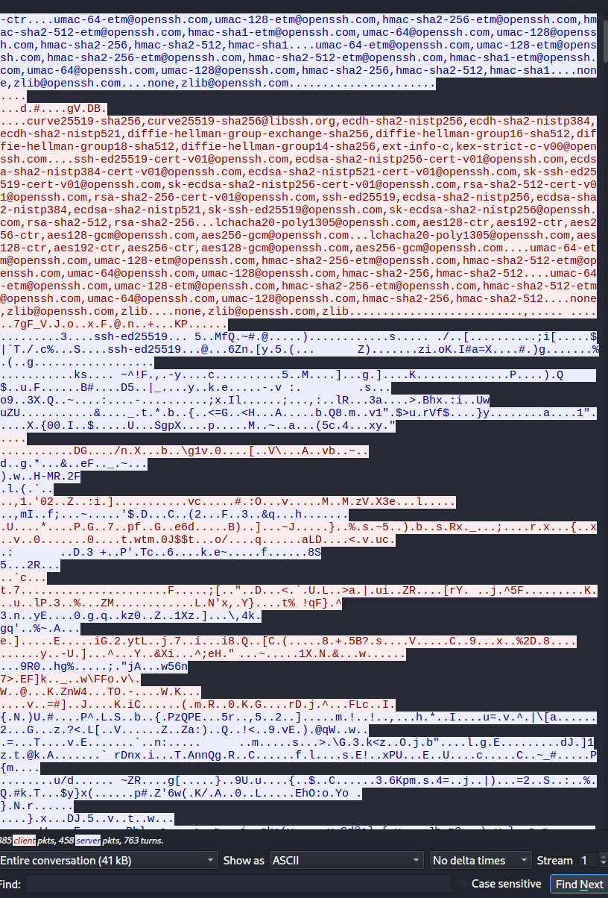

---

## Telnet Capture

I started another tcpdump capture for Telnet traffic on TCP port 23.

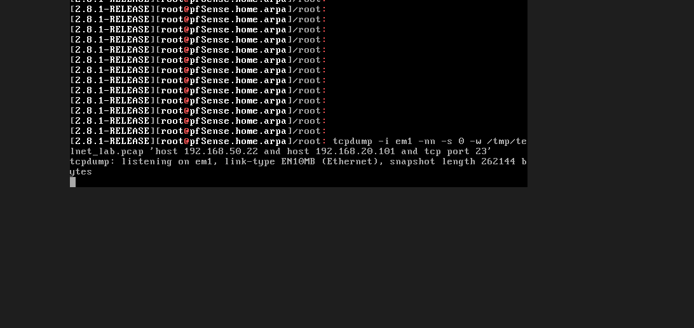

The Windows machine then connected to Kali using Telnet and ran remote commands.

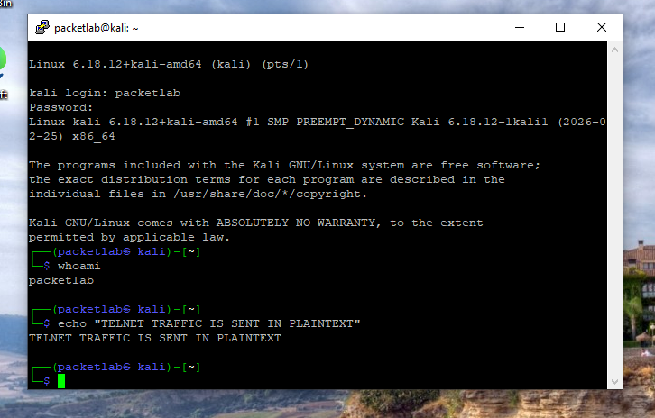

Using tcpdump with ASCII output showed readable Telnet session information because Telnet does not encrypt its traffic.

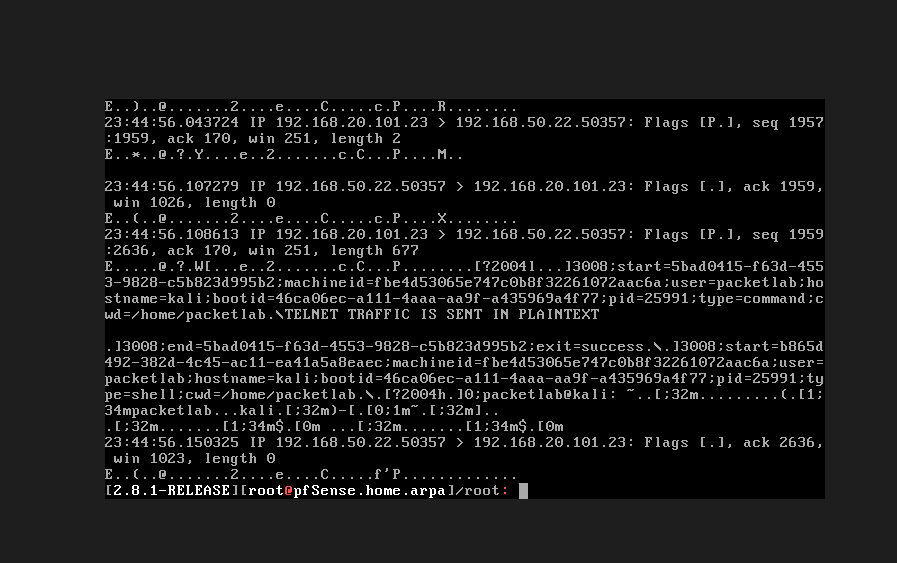

I opened the Telnet PCAP file in Wireshark and followed the TCP stream.

The username, commands, responses, and other session information were visible in plaintext.

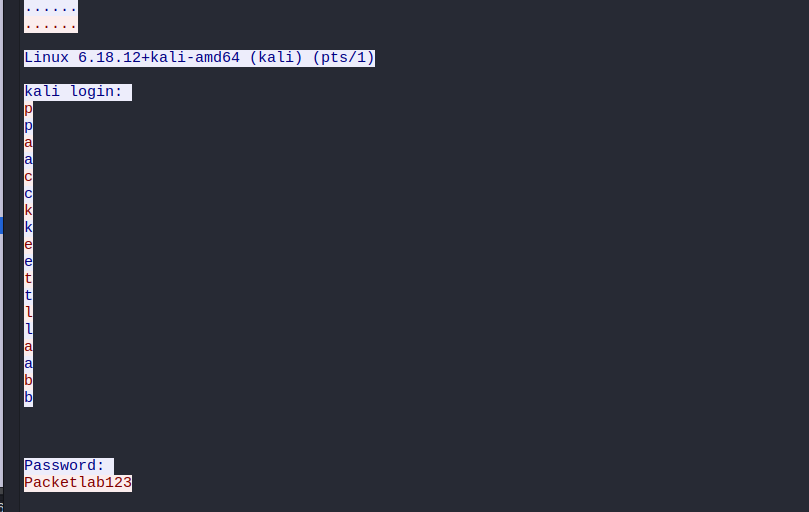

---

## Cleanup

After completing the lab, I disabled and removed Telnet, deleted the temporary account, removed the packet captures, and confirmed that port 23 was no longer listening.


---

## Results

This lab demonstrated the security difference between SSH and Telnet:

```text
SSH
- Uses TCP port 22
- Encrypts remote-access traffic
- Commands and credentials are not readable in Wireshark

Telnet
- Uses TCP port 23
- Sends traffic in plaintext
- Commands and session information can be viewed in tcpdump and Wireshark
```

---

## What I Learned

Through this lab, I learned how to:

- Enable SSH and Telnet services on Linux
- Remotely access Linux from a Windows machine
- Allow remote-access traffic through pfSense
- Capture traffic with tcpdump
- Save packet captures as PCAP files
- Download and open PCAP files in Wireshark
- Apply Wireshark display filters
- Follow TCP streams
- Compare encrypted SSH traffic with plaintext Telnet traffic

This lab demonstrated why SSH should be used instead of Telnet for secure remote administration.
# Lab 7: 802.1X Authentication with FreeRADIUS

## Objective

The goal of this lab was to configure **802.1X port-based authentication** on a Cisco switch.

A physical laptop acted as the **supplicant**, the Cisco switch acted as the **authenticator**, and Kali Linux hosted the **FreeRADIUS authentication server**.

```text
Laptop
   │
   │ EAPOL
   ▼
Cisco Switch
   │
   │ RADIUS
   ▼
pfSense
   │
   ▼
Kali Linux
FreeRADIUS
```

---

## FreeRADIUS Server

I configured FreeRADIUS on Kali Linux and started it in debug mode so I could monitor authentication requests from the Cisco switch.

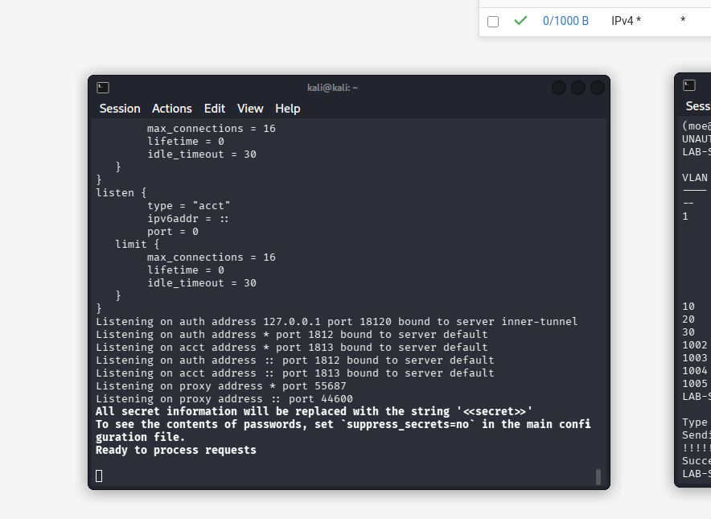

---

## Cisco 802.1X Configuration

I enabled AAA and 802.1X on the Cisco switch and configured the laptop's physical switchport to require authentication.

The laptop remained on VLAN 20, but the port would not allow normal network access until authentication was successful.

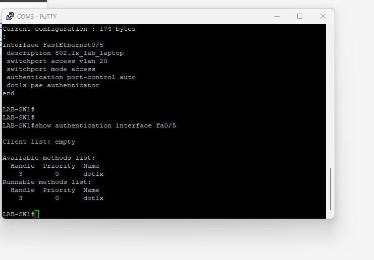

---

## Failed Authentication

I first attempted to connect using incorrect credentials.

The Cisco switch forwarded the authentication request to FreeRADIUS, which rejected the login.

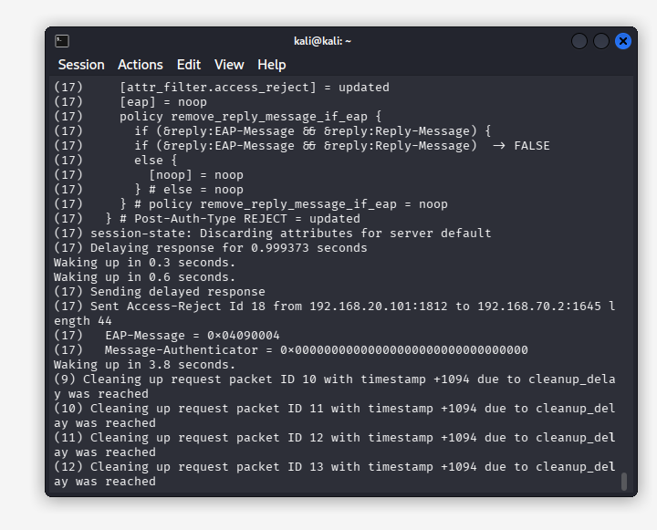

---

## EAPOL Packet Capture

I captured the authentication traffic with Wireshark and filtered for EAPOL traffic.

This showed the 802.1X communication between the laptop and the Cisco switch.

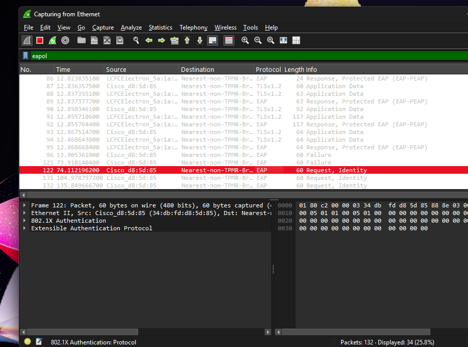

---

## Successful Authentication

I then authenticated using the correct credentials.

FreeRADIUS accepted the authentication request, the Cisco switch authorized the port, and the laptop was able to access the network.

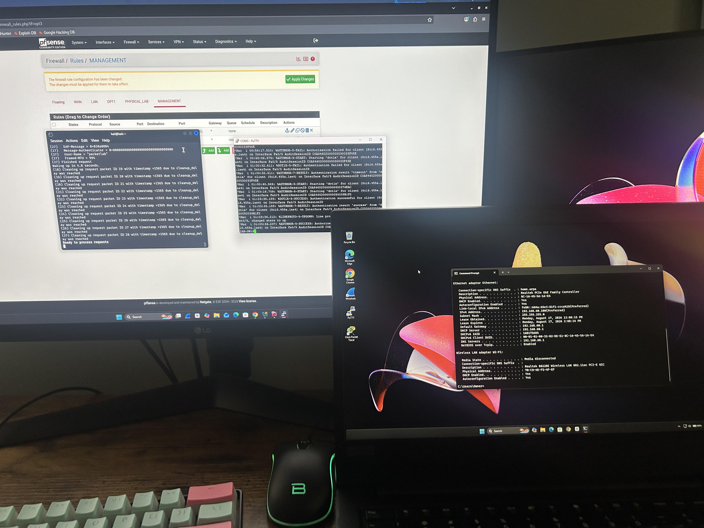

---

## Results

The lab demonstrated the difference between failed and successful 802.1X authentication:

```text
Incorrect Credentials
        ↓
RADIUS Reject
        ↓
Switchport Unauthorized


Correct Credentials
        ↓
RADIUS Accept
        ↓
Switchport Authorized
        ↓
Network Access
```

---

## What I Learned

Through this lab, I learned how to:

- Configure 802.1X authentication on a Cisco switchport
- Configure FreeRADIUS on Kali Linux
- Understand the supplicant, authenticator, and authentication server roles
- Use RADIUS for centralized authentication
- Understand the difference between EAPOL and RADIUS traffic
- Capture EAPOL traffic with Wireshark
- Observe failed and successful authentication attempts
- Restrict physical network access until authentication succeeds

# Lab 8: Remote Access VPN with pfSense and OpenVPN

## Objective

The goal of this lab was to configure a remote access VPN using pfSense and OpenVPN. The VPN allowed my physical laptop to securely access the Kali Linux network through an encrypted tunnel.

## Network Setup

- pfSense acted as the VPN server and firewall.
- Kali Linux was located on the `192.168.20.0/24` network.
- OpenVPN used the `10.8.0.0/24` tunnel network.
- The physical laptop connected through normal Wi-Fi.
- VirtualBox port forwarding allowed OpenVPN traffic to reach the pfSense WAN interface.

## Before VPN Connection

Before connecting to OpenVPN, the physical laptop could not reach the Kali Linux machine at `192.168.20.101`.

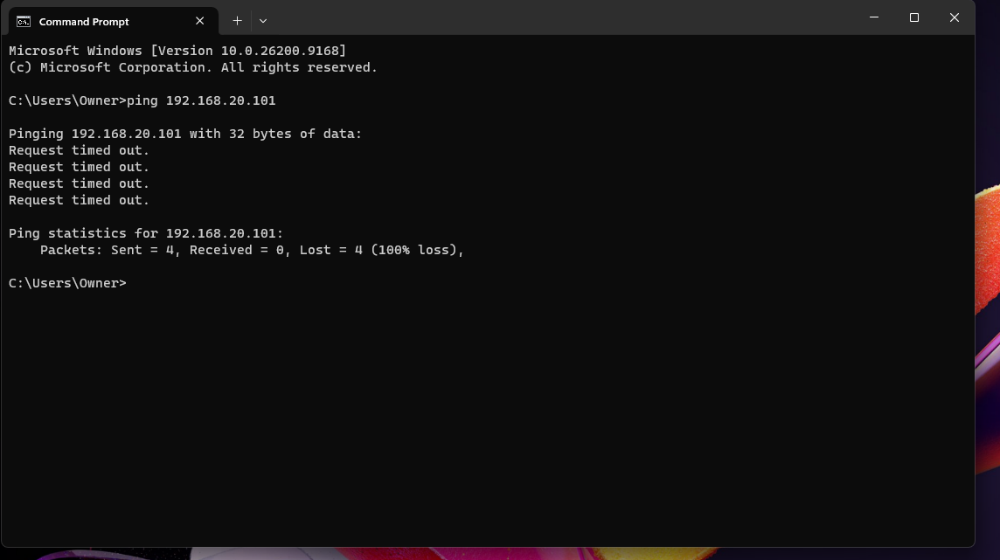

## VirtualBox Port Forwarding

Because the pfSense WAN interface was behind VirtualBox NAT, UDP port `1194` was forwarded from the host machine to the pfSense WAN interface.

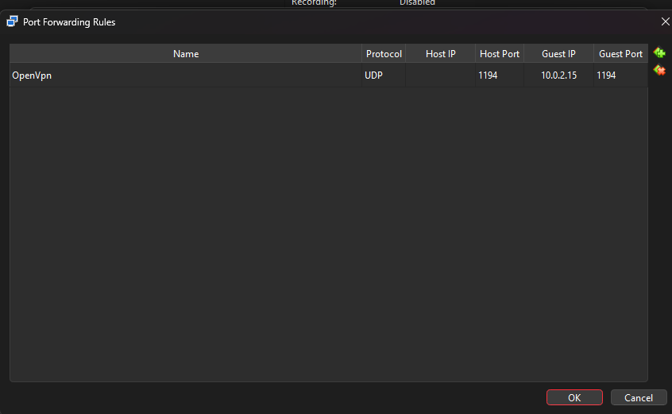

## pfSense OpenVPN Configuration

OpenVPN was configured on pfSense using:

- UDP port `1194`
- VPN tunnel network `10.8.0.0/24`
- Protected network `192.168.20.0/24`
- User authentication and certificates
- OpenVPN firewall rules

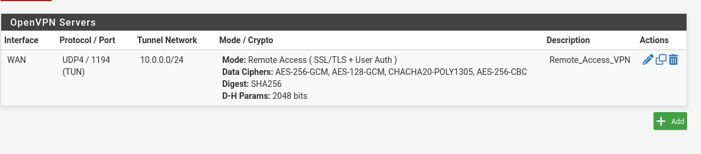

## Successful VPN Connection

After importing the `.ovpn` configuration file into the OpenVPN client, the laptop successfully connected to pfSense.

The laptop received a VPN address from the `10.8.0.0/24` network and could now communicate with Kali Linux at `192.168.20.101`.

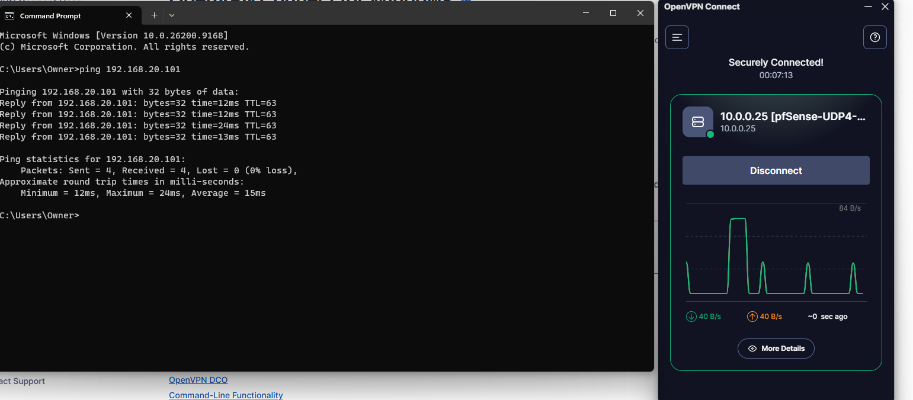

## Encrypted VPN Traffic

Wireshark was used on the laptop's Wi-Fi interface to inspect the traffic.

Instead of seeing the original ICMP traffic to Kali Linux, the Wi-Fi interface showed encrypted OpenVPN traffic using UDP port `1194`.

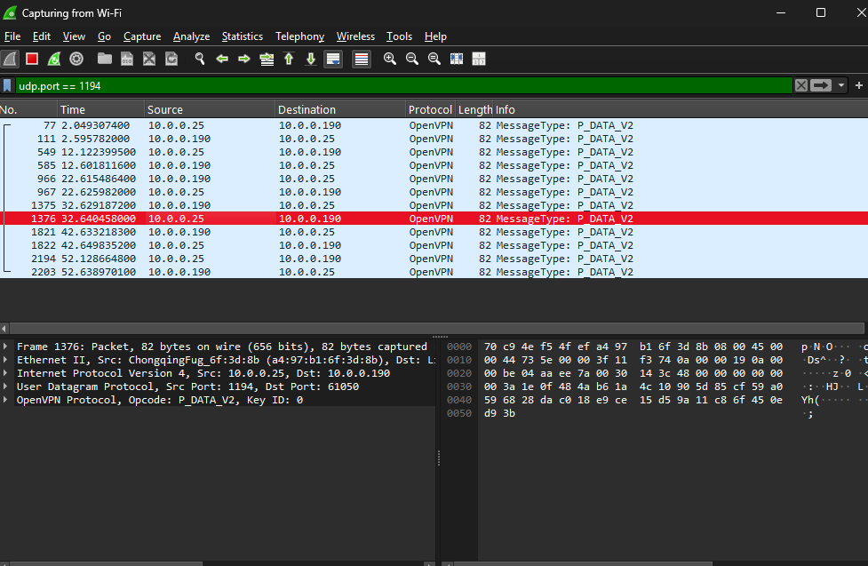

## What I Learned

- How to configure a remote access VPN using pfSense and OpenVPN.
- How to configure VirtualBox NAT port forwarding.
- How to create a certificate authority, server certificate, and VPN user.
- How to export and import an OpenVPN `.ovpn` client configuration.
- How VPN clients receive a separate virtual IP address.
- How routes are pushed to VPN clients for protected internal networks.
- How split tunneling allows normal Internet traffic to continue using Wi-Fi while lab traffic uses the VPN.
- How VPN traffic is encrypted and encapsulated before traveling across the physical network.
- How pfSense decrypts VPN traffic and routes it to the correct internal network.
- How firewall rules control what VPN clients are allowed to access.

# Wazuh SIEM Deployment and Windows Monitoring

## Objective

The goal of this lab was to deploy a Wazuh SIEM on an Ubuntu Server VM and connect my Windows 10 VM as an agent.

This allowed me to collect and view Windows security events from one centralized dashboard.

## Network Setup

The Wazuh server was placed on the same VirtualBox internal network as my Windows 10 VM.

Both devices are on the `192.168.50.0/24` network.

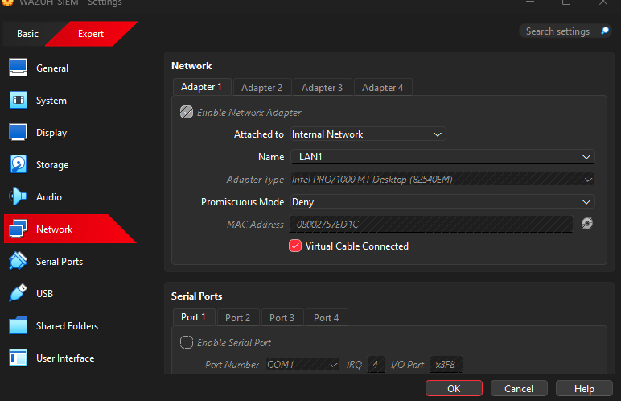

## Wazuh Installation

I installed the Wazuh all-in-one deployment on Ubuntu Server.

This includes the Wazuh manager, indexer, and dashboard.

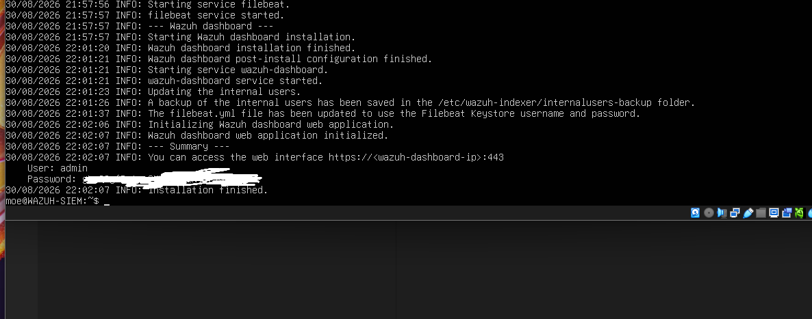

## Wazuh Dashboard

After the installation finished, I accessed the Wazuh dashboard from my Windows 10 VM.

The dashboard gives one central location to view connected agents, security events, and alerts.

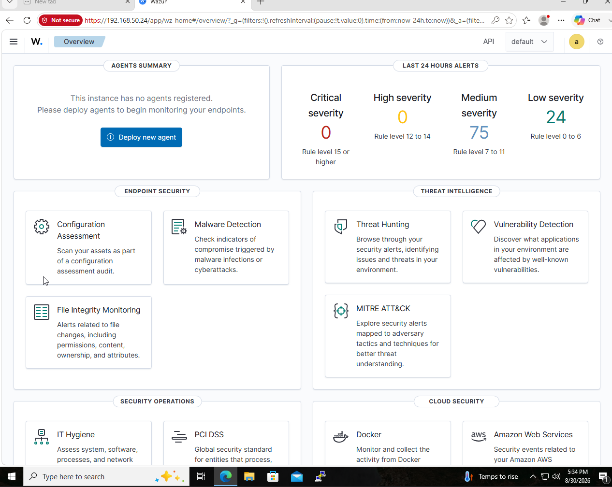

## Windows 10 Agent

I installed the Wazuh agent on my Windows 10 VM and connected it to the Wazuh server.

The Windows machine then appeared as an active agent in the SIEM.

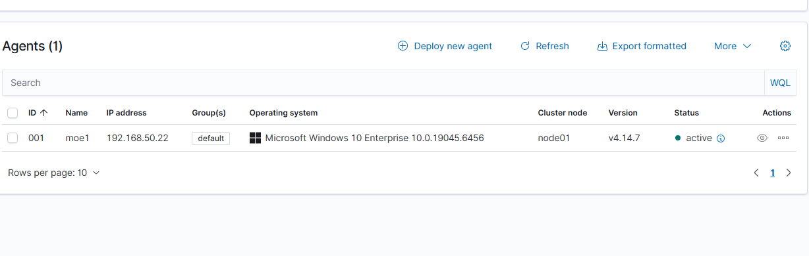

## Threat Detection Test

To test the SIEM, I generated an incorrect login attempt on the Windows VM.

Wazuh collected the Windows security event and displayed the login failure in the Threat Hunting dashboard.

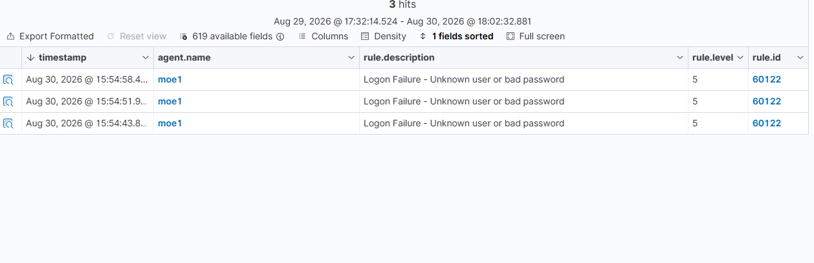

## What I Learned

- How a SIEM collects and centralizes security logs.
- How Wazuh agents send endpoint events to the SIEM.
- How Windows security events can be viewed in Wazuh.
- The difference between endpoint monitoring with Wazuh and network monitoring with Suricata.
- How multiple virtual machines can communicate on the same VirtualBox internal network.

## Result

The Wazuh SIEM was successfully deployed and the Windows 10 VM was connected as an active agent.

Wazuh successfully detected and displayed a failed Windows login event in the Threat Hunting dashboard.
